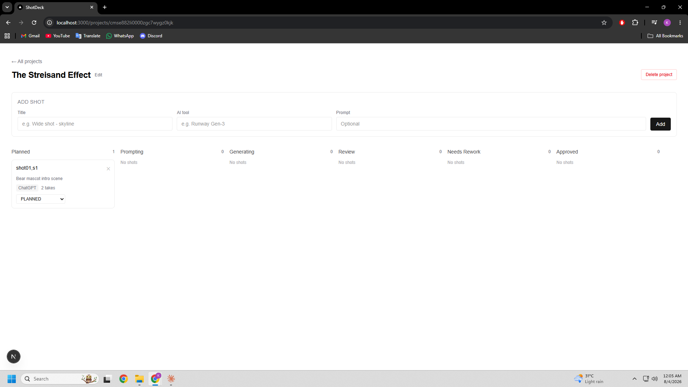

# 🎬 ShotDeck

**ShotDeck is a local-first, shot-level production tracker for AI-assisted video workflows.**

Instead of managing a 30–50 shot project in a spreadsheet, ShotDeck keeps each shot's prompt, status, takes, selected asset, notes, and production history together in one place.



## Why ShotDeck exists

Faceless and AI-assisted video production creates a coordination problem before it creates an editing problem. A single video can involve dozens of shots, multiple prompt revisions, several generations per shot, rejected takes, approved takes, and files spread across different tools.

ShotDeck turns that into a visible workflow:

```text
Project
  ↓
Ordered Shots
  ↓
Prompt / Negative Prompt
  ↓
Generation Takes
  ↓
Review + Selection
  ↓
Approved production asset
```

## Current default-branch features

- Create and manage video projects
- Ordered shot board with production statuses
- Store title, description, prompt, negative prompt, AI tool, duration, notes, and video link per shot
- Track multiple generation Takes per shot
- Select exactly one preferred Take for a shot
- Bulk-import structured shot lists
- Optional AI-assisted parsing through an OpenAI-compatible provider
- Local SQLite data storage
- Localhost-only development/runtime binding
- Validation and guarded server actions for safer local use

## Production pipeline work

A larger local production pipeline is currently being validated in **[PR #1 — Build the complete local AI-video production pipeline](https://github.com/kaziaiops/ShotDeck/pull/1)**.

That branch adds the next stage of ShotDeck: still-image intake/review, ComfyUI queueing and polling, WAN preview generation, approved-only upscale flow, local output organization, and production-oriented status handling.

The PR intentionally remains unmerged until its real ComfyUI workflows are verified on the target Windows/GPU environment. Hardware verification is tracked in **[Issue #2](https://github.com/kaziaiops/ShotDeck/issues/2)**.

## Stack

- **Next.js** App Router
- **React + TypeScript**
- **Tailwind CSS**
- **Prisma + SQLite**
- Optional **OpenAI-compatible** provider for shot-list parsing
- Local-only runtime by design

## Data model

```text
Project
  └── Shot
       └── Take
```

A Project contains ordered Shots. A Shot stores the production context and can have multiple Takes so failed or rejected generations do not erase history.

See [`prisma/schema.prisma`](./prisma/schema.prisma) for the source of truth.

## Getting started

### Requirements

- Node.js 20+
- npm

### Install

```bash
cp .env.example .env
npm ci
npx prisma migrate dev
npm run dev
```

Open:

```text
http://127.0.0.1:3000
```

ShotDeck has no authentication and is intended to run locally. **Do not expose the development or production server directly to the public internet.**

## Useful commands

```bash
npm run dev
npm run build
npm run lint
npm run db:migrate
npm run db:studio
```

## Project direction

See [`ROADMAP.md`](ROADMAP.md) for the current engineering priorities and what must be verified before the production-pipeline branch is ready to merge.

## Contributing

ShotDeck is still early-stage. Bug reports and focused improvements are useful, especially around production reliability, data integrity, local workflow automation, and documentation.

When reporting a bug, include:

- operating system,
- Node.js version,
- steps to reproduce,
- expected behavior,
- actual behavior,
- and relevant error output with secrets removed.

## License

MIT — see [`LICENSE`](LICENSE).

---

> **Design principle:** the project board should always make it obvious what exists, what is approved, what failed, and what still needs work.
